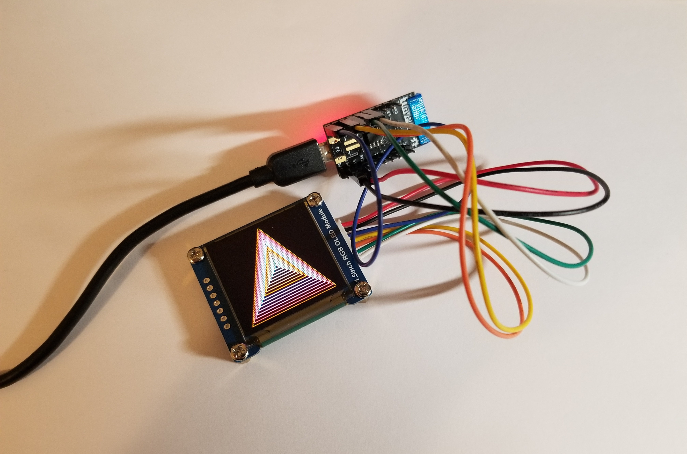

This repository derives from the
[demo code](https://www.waveshare.com/wiki/File:1.5inch_RGB_OLED_Module_Code.7z)
for the [Waveshare 1.5inch RGB OLED Module](https://www.waveshare.com/wiki/1.5inch_RGB_OLED_Module).

Changes I made to the original version:

* Made a proper Arduino repository

* Eliminated globals and most compiler macros in C++ classes

* Eliminated non-SPI code

I have tested this library on the following boards:

* TinyPICO: 
    * VCC => 5V
    * GND => GND
    * DIN => 23 (MOSI)
    * CLK => 18 (SCK)
    * CS => 5 (SS)
    * DC => 22
    * RST => 21
